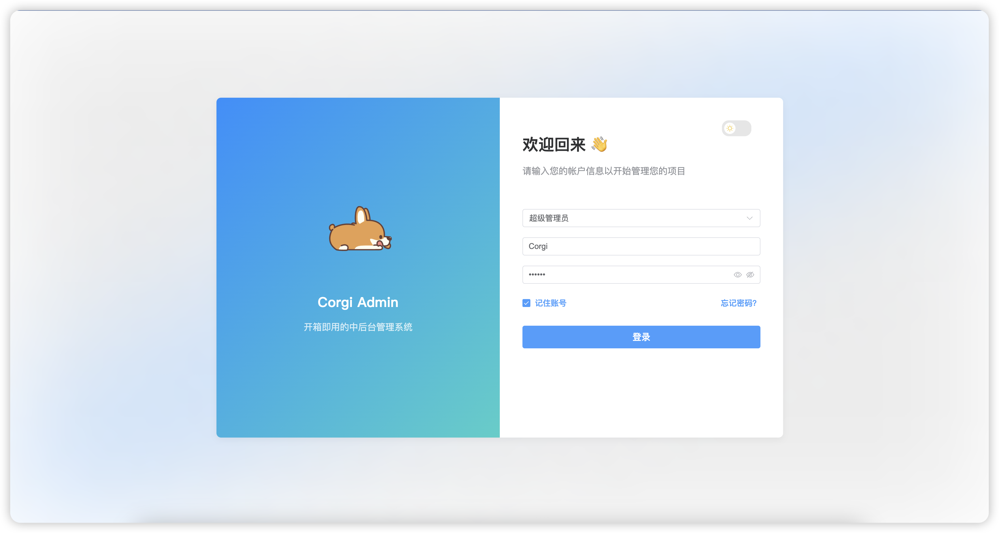
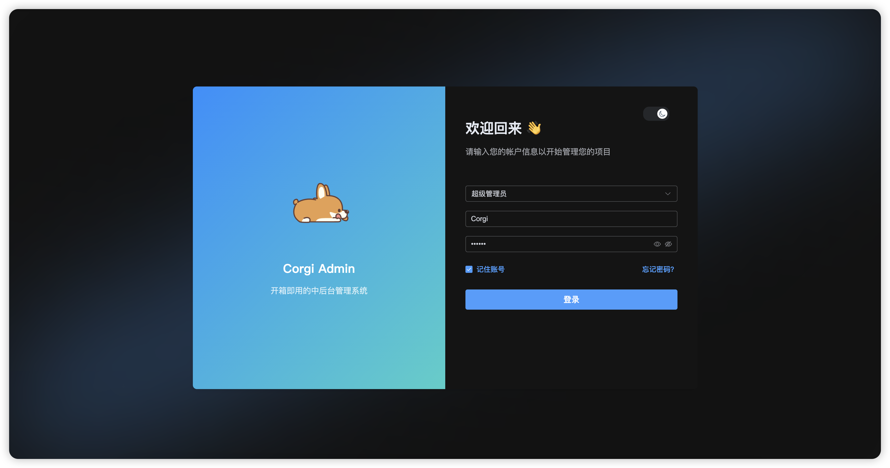

# Corgi Admin

## 项目介绍

这是一个基于 Vue 3、TypeScript 和 Vite 构建的现代化后台管理系统。项目采用了最新的前端技术栈，提供了丰富的功能组件和优秀的开发体验。

## 技术栈

- **Vue 3**：采用 Vue 3 组合式 API，提供更好的代码组织和复用能力
- **TypeScript**：使用 TypeScript 进行类型检查，提高代码质量和可维护性
- **Vite**：新一代前端构建工具，提供极速的开发体验
- **Element Plus**：基于 Vue 3 的组件库，提供丰富的 UI 组件
- **Pinia**：Vue 3 的状态管理方案，提供简单高效的状态管理能力
- **Vue Router**：Vue.js 官方路由管理器

## 目录结构

```
├── public/                 # 静态资源目录
├── src/                    # 源代码目录
│   ├── assets/            # 项目资源文件
│   ├── components/        # 公共组件
│   ├── layout/            # 布局组件
│   ├── router/            # 路由配置
│   ├── store/             # 状态管理
│   ├── utils/             # 工具函数
│   ├── views/             # 页面组件
│   ├── App.vue           # 根组件
│   └── main.ts           # 入口文件
├── .env                   # 环境变量配置
├── package.json          # 项目依赖配置
├── tsconfig.json         # TypeScript 配置
└── vite.config.ts        # Vite 配置
```

## 特性功能

- 🎨 可配置的主题设置
- 🌓 明暗主题切换
- 📱 响应式布局
- 🔐 用户认证和授权
- 📊 仪表盘数据展示
- ⚡️ 快速的热重载开发体验

## 项目预览

### 明亮主题


### 暗黑主题


## 开发环境配置

### 环境要求

- Node.js 16+
- pnpm 8+

### 安装依赖

```bash
pnpm install
```

### 开发服务器

```bash
pnpm dev
```

### 构建生产版本

```bash
pnpm build
```

### 预览生产构建

```bash
pnpm preview
```

## 开发指南

1. 组件开发请遵循 Vue 3 组合式 API 的最佳实践
2. 使用 TypeScript 编写代码，确保类型安全
3. 遵循项目既定的代码风格和目录结构
4. 新功能开发前请先在 issues 中讨论

## 贡献指南

1. Fork 本仓库
2. 创建你的特性分支 (git checkout -b feature/AmazingFeature)
3. 提交你的改动 (git commit -m 'Add some AmazingFeature')
4. 推送到分支 (git push origin feature/AmazingFeature)
5. 提交 Pull Request